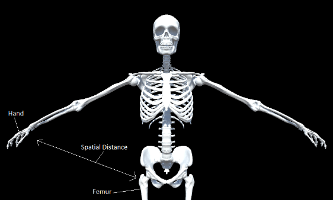
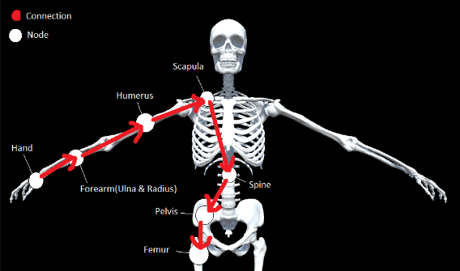
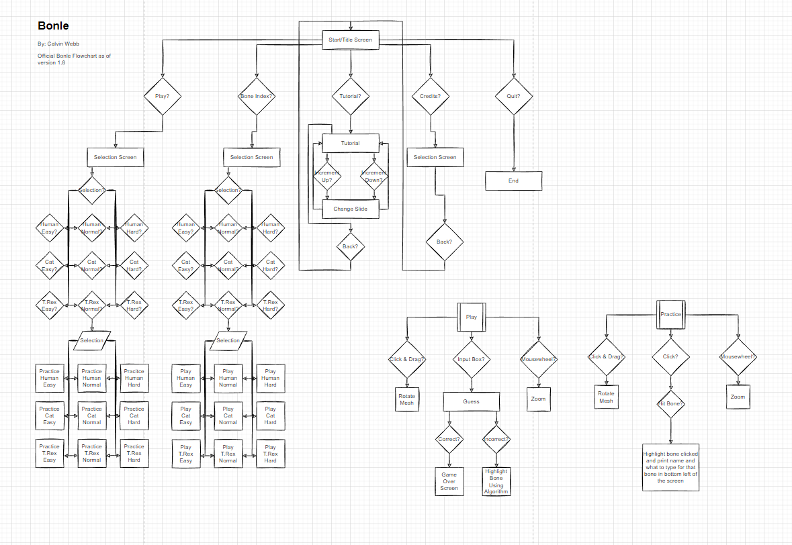
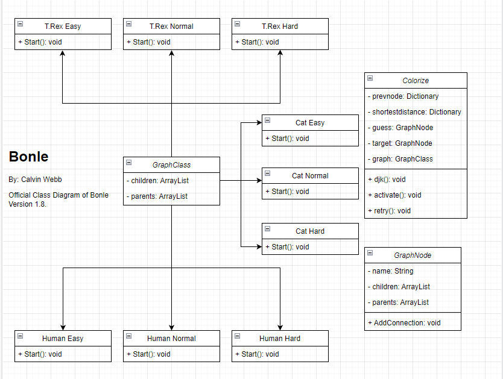
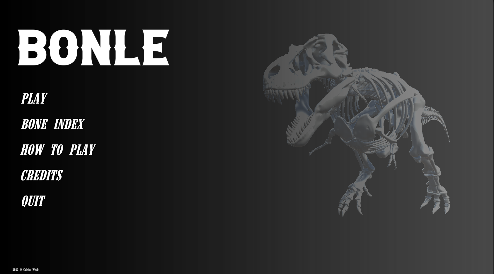
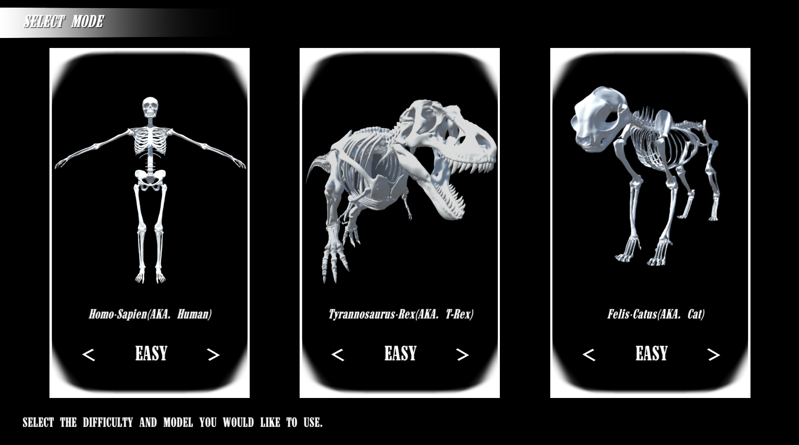
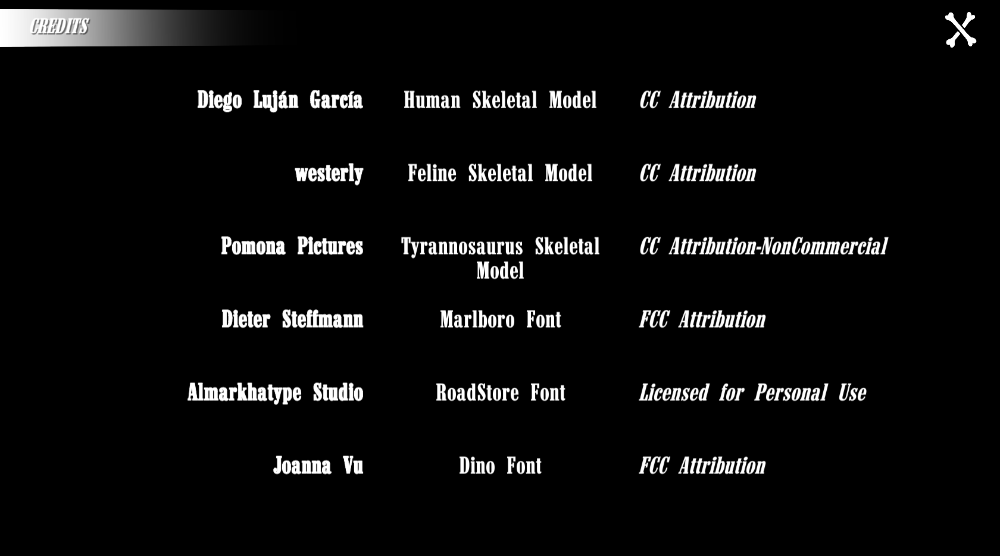

# What is Bonle?
 Bonle is an application/video game I designed that will help people learn skeletal anatomy for any reason they might need it. You are given the choice between a Human skeleton, T. Rex skeleton, and a Cat Skeleton, and your goal is to find which of the bones/bone groups has been chosen as the target. When you guess a bone, it will change color based on how close it is to the target bone(Hot/Cold Algorithm). Using that information you try and guess the target bone. I chose the skeletons that I did so that researchers/students from three fields of science could use it to study their respective sciences, those being Anatomical Studies, Veterinary Studies, and Paleontology.

# Inspiration
 I drew my inspiration from some of the most popular online games in the past few years such as [Wordle](https://www.nytimes.com/games/wordle/index.html "Wordle Official Site") and [Globle](https://globle-game.com/game "Globle Official Site"). These games both use a system of word based guessing in an effort to find a target word in the case of Wordle, and target country in the case of Globle. What I really wanted to replicate was the Hot/Cold algorithm employed in Globle to display the proximity of countries to one another.

# Hot/Cold Algorithm

Spacial Hot/Cold: 
* The Spacial Hot/Cold algorithm uses the physical 3D space between objects to determine how far away they are, and hence what color they should be. The specific distances that it uses to color the objects is up to you and is often dependent on the units.

Node Based Hot/Cold: 
* The Node Based Hot/Cold algorithm instead uses the connections between objects to determine how far away in their “chain” or tree they are. The connections can be anything that connect those two objects specifically, for my project the connections represent whether or not the objects are touching each other. The algorithm that actually finds the shortest distance from node to node is called Dijkstra’s Algorithm, and while its not the fastest it works for my uses.

Spacial             |  Node-Based
:-------------------------:|:-------------------------:
  |  

# Flowchart & Class Diagram

|Flowchart             
:-------------------------:

|Class Diagram          
:-------------------------:
  

# Major UI

|Title Screen         
:-------------------------:

* The selection screen is used to navigate through the models and each of the difficulties on each of the models. There are two selection screens in the game, one for the actual logic/main playing part of the game and another for the bone index, so you can choose which model and difficulty you want to practice.

|Selection Screen         
:-------------------------:
  

# Credits
* Due to the nature of the project, I did not attempt to make the models myself, as I assumed there were much more talented people who would be able to model anatomically correct models so in the title screen there is an option for credits, where I source each of the different copyrighted resources I used and what attribution they are under.

|Credits       
:-------------------------:
  
